# Model Comparison

## Fitting Statistics

First we check the outliers in the data by the fitting statistics:

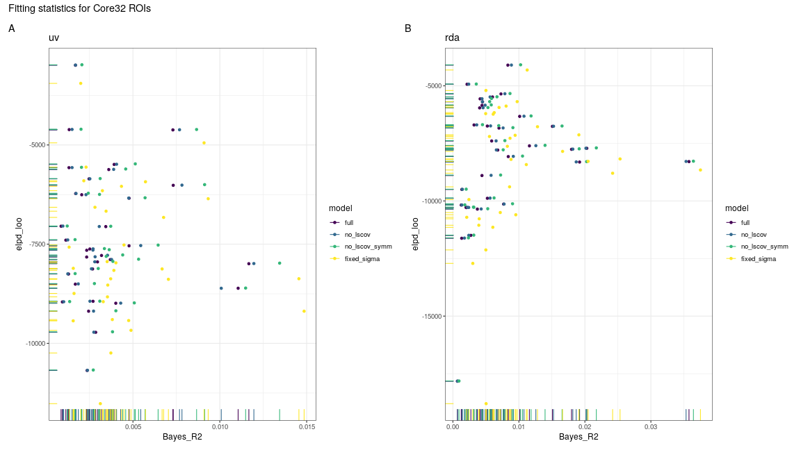

The data now looks normal and there seems no outliers.


```r
outlier_dat <- dat %>% filter(Term == "elpd_loo", Estimate < -60000)
outlier_dat
```

```
## # A tibble: 0 x 16
## # … with 16 variables: model <ord>, response <ord>, session <chr>, Term <chr>, Estimate <dbl>, Est.Error <dbl>, CI.Lower <dbl>, CI.Upper <dbl>, Q.Lower <dbl>, Q.Upper <dbl>, MAP <dbl>, rhat <dbl>,
## #   ess_bulk <dbl>, ess_tail <dbl>, Grouping <chr>, region <chr>
```

```r
outliers <- outlier_dat$region
dat <- dat %>% filter(!region %in% .env$outliers)
```

Then we compare the Bayesian R-squared of the models (see [here](https://paul-buerkner.github.io/brms/reference/bayes_R2.brmsfit.html)). Each line is for one ROI. The higher the value, the better the fit.


```
## # A tibble: 4 x 2
##   model         mean_R2
##   <ord>           <dbl>
## 1 fixed_sigma   0.00740
## 2 no_lscov_symm 0.00656
## 3 no_lscov      0.00564
## 4 full          0.00544
```

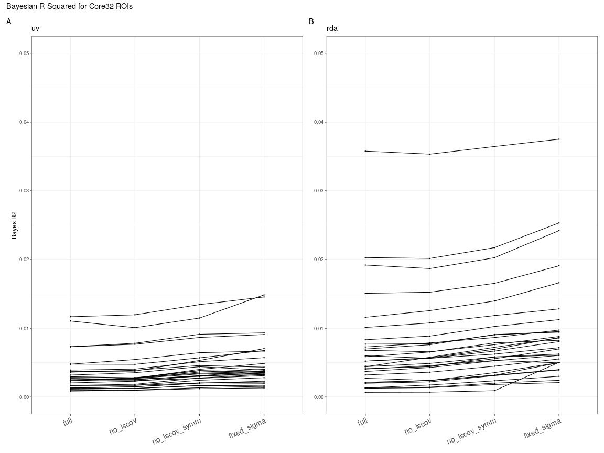

We can see that generally, fixed_sigma > no_lscov_symm > no_lscov > full.

Next we show the difference in the expected log predictive density (elpd) estimated by leave-one-out (loo) cross-validation across models (see [here](https://mc-stan.org/loo/reference/loo.html)). The higher the value, the better the fit. Here "full" is used as the base level.


```
## [1] "Range of the difference in EPLD_LOO between different models:"
```

```
##                                 Q0          Q5         Q25         Q50         Q75         Q95        Q100
## no_lscov - full         -0.2954626    1.954661    3.092248    4.526943    6.099215    8.368128    9.151479
## no_lscov_symm - full     3.1950237    6.436310    9.794434   13.406579   16.338879   20.509315   21.183684
## fixed_sigma - full   -1091.5676938 -829.428617 -530.832441 -460.460139 -361.512892 -244.133911 -211.908114
```

```
## Warning: Removed 32 row(s) containing missing values (geom_path).
```

```
## Warning: Removed 32 rows containing missing values (geom_point).
```

```
## Warning: Removed 32 row(s) containing missing values (geom_path).
```

```
## Warning: Removed 32 rows containing missing values (geom_point).
```

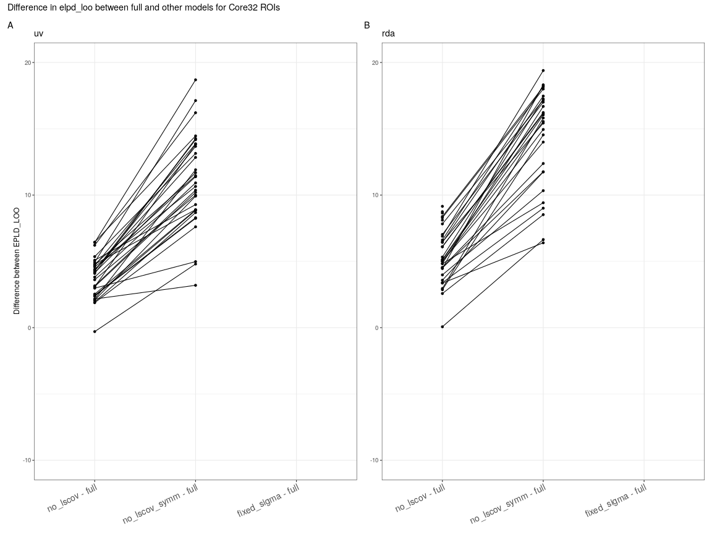

We can see that "no_lscov_symm" is the best and "fixed_sigma" is much worse than others. Results using [waic](https://mc-stan.org/loo/reference/waic.html) instead of `loo` are almost identical.


## Test-Retest Reliability

### Distribution Plots

Here we plot the distribution of TRR over 32 ROIs for each response type and model:

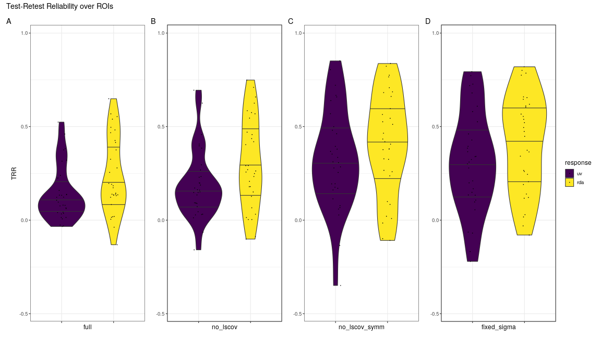

Then we plot the distribution of the difference in TRR between different response types for each model.

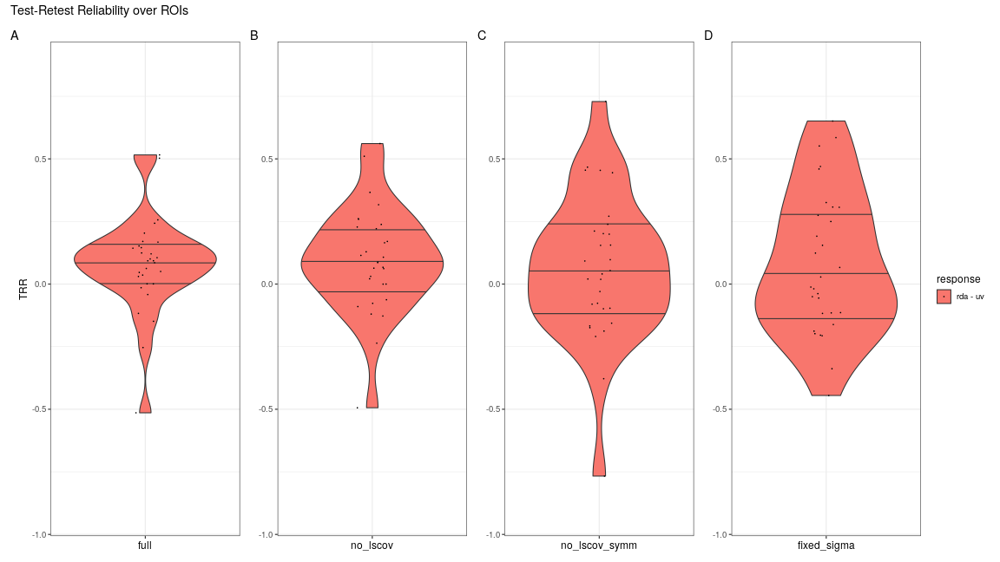

This is a similar plot but for the difference between models for each response type:

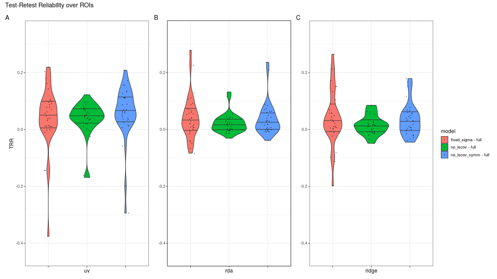

### Brain Plots

Here we compare the test-retest reliability (TRR) of high-low control demand contrast among response variables and models:

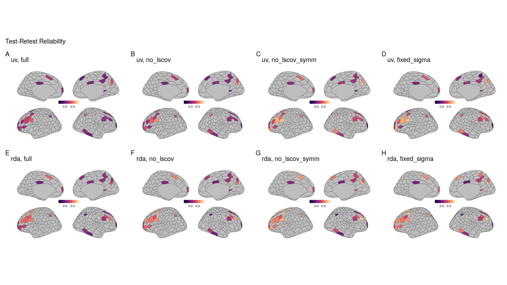

Here we plot the difference in TRR between different types of response:

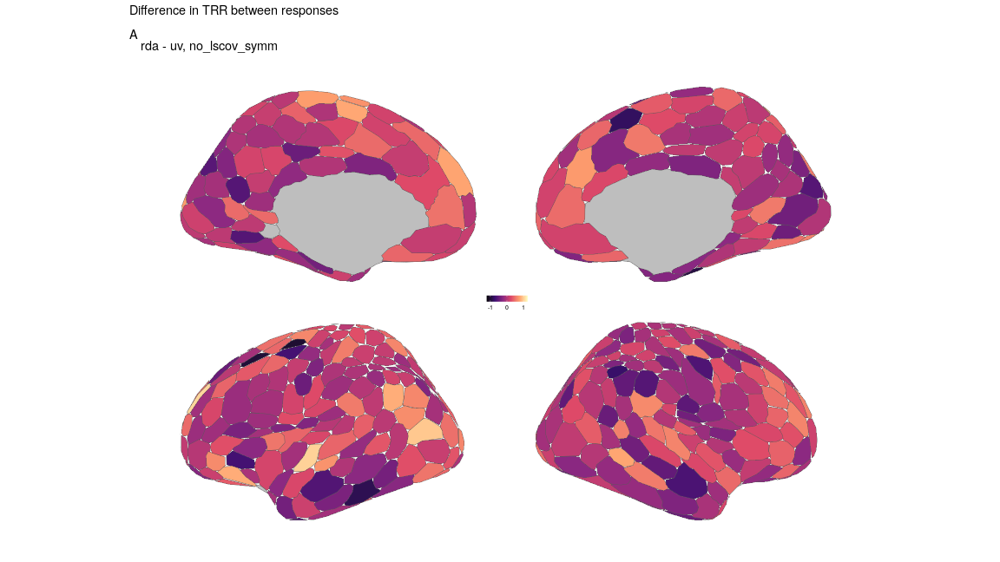

and between different models:

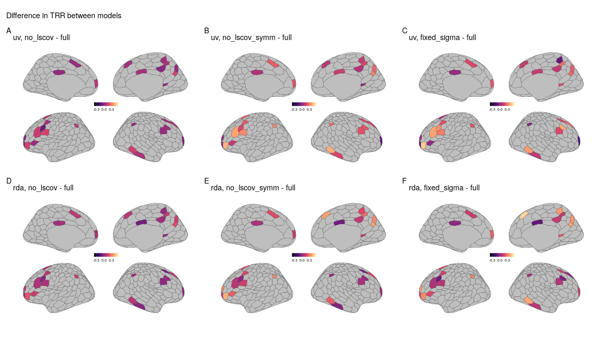

## Comparison with Previous Results

Here we plot the TRR over core32 parcels and compare it with our previous results. The old method is different from the current one in the following ways:

- Subjects: only 18 instead of 27
- Preprocessing: no divisive normalization for each session
- Response variables:
  - "ridge" uses `mda::fda()`, which is similar to `"rda"` but implemented using ridge regression
  - "rda_full" and "rda_diag" use `sparsediscrim::lda_schafer()` instead of `klaR` to generate the response variable, with either the full covariance matrix (including noise correlation) or only its diagonal (the signal).
  - "uv" is not demeaned for each run
- The TRR model is similar to "fix_sigma" model except that:
  - The model is Gaussian instead of t-distributed
  - The fixed effects are treatment-coded

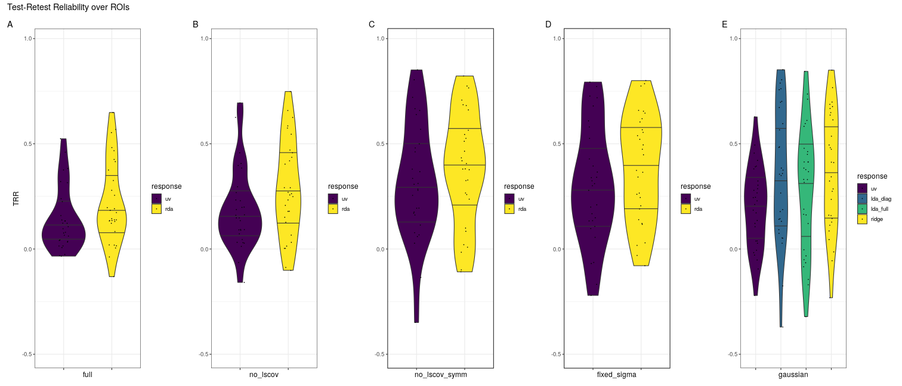

And the distribution of the difference between response types:

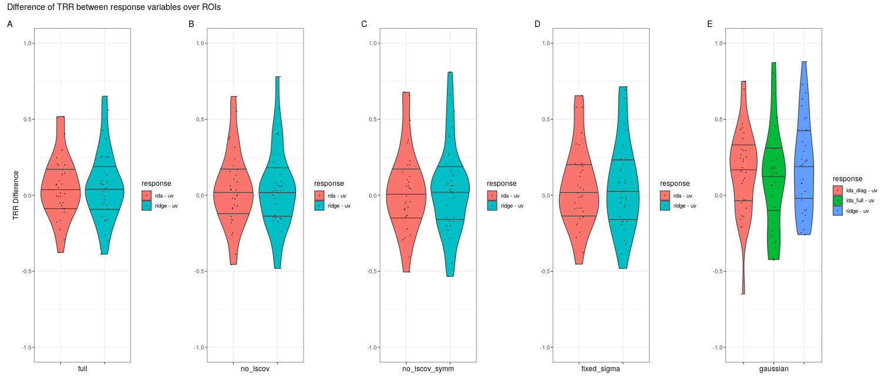
