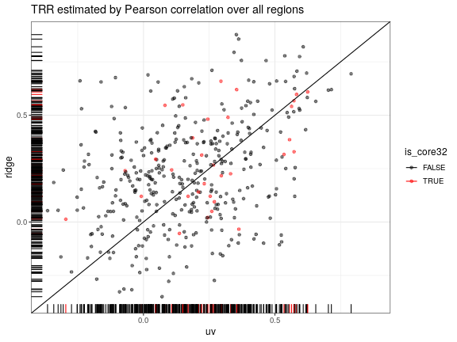
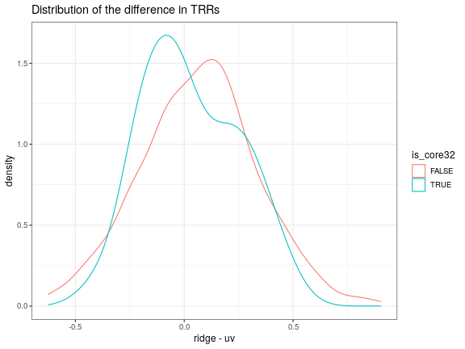
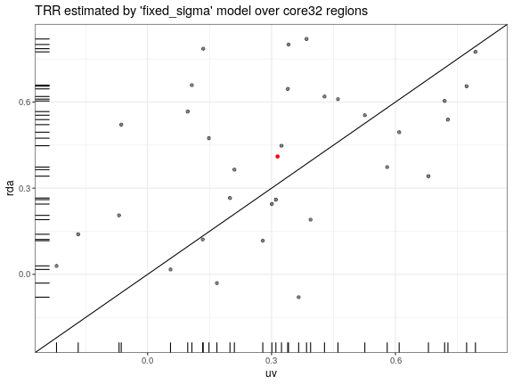
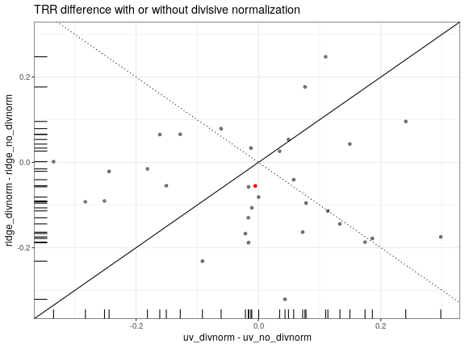
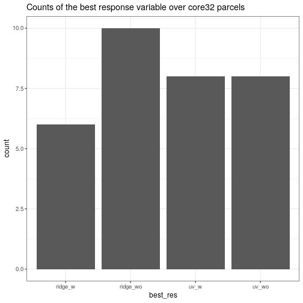
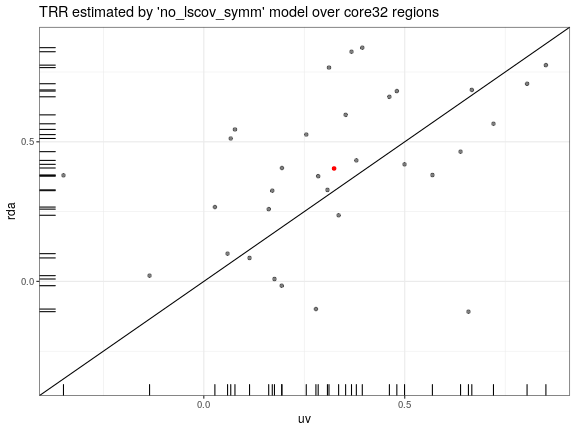
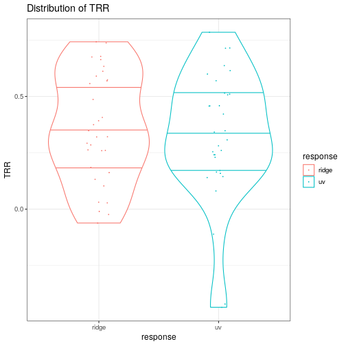
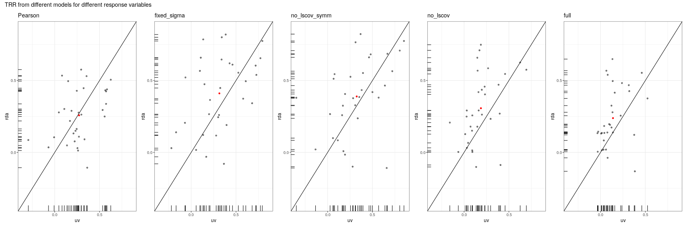

# Relilability Modeling Results

This document outlines the test-retest reliability (TRR) models considered in this project, and relavant results. The TRRs are calculated in "baseline" session only.

## Design and Notation


- trial $t \in 1, ..., T$
- condition $c \in \{\text{incongruent}, \text{congruent}\}$
- task $k \in \{\text{axcpt}, \text{stroop}\}$
- session $s \in \{\text{baseline}, \text{proactive}, \text{reactive}\}$
- repetition $r \in \{\text{test}, \text{retest}\}$
- participant $p \in 1, ..., P$
- Response variable: $y$, considered here for a single ROI and for a single type of spatial model (i.e., univariate or multivariate model)

The following indicator variables will be used to denote a $\textbf{dummy or treatment-coding}$ scheme:

$$
\begin{equation*}
\begin{split}
	&\text{incon} = 
	\begin{cases}
		1 & \text{if condition = incongruent} \\
		0 & \text{if condition = congruent}
	\end{cases},\\
	&\text{retest} = 
	\begin{cases}
		1 & \text{if repetition = retest} \\
		0 & \text{if repetition = test}
	\end{cases},\\
	&\text{test} = 1 - \text{retest}
\end{split}
\end{equation*}
$$


The following expression will be used to denote a $\textbf{contrast-coding}$ scheme for the condition factor:

$$
  \text{stroop} = 
  \begin{cases}
    \frac{1}{2} & \text{if condition = incongruent} \\
    -\frac{1}{2} & \text{if condition = congruent}
  \end{cases}
$$

## Model 0: Pearson correlations

$$
z_{rp} = {\langle y_{tcrp} \rangle}_{t,\ c = \text{Incongruent}} - {\langle y_{tcrp} \rangle}_{t,\ c = \text{Congruent}} \\
\text{TRR} = \text{Cor}(z_{1p}, z_{2p})
$$

First we plot the TRR estimated from univariate or multivariate methods for each region:


```
## [1] "TRRs estimated from Pearson correlation:"
```

```
## # A tibble: 400 x 4
##    region                        ridge     uv is_core32
##    <chr>                         <dbl>  <dbl> <lgl>    
##  1 17Networks_LH_ContA_Cingm_1 -0.149  0.292  FALSE    
##  2 17Networks_LH_ContA_IPS_1    0.532  0.592  FALSE    
##  3 17Networks_LH_ContA_IPS_2    0.0179 0.482  FALSE    
##  4 17Networks_LH_ContA_IPS_3    0.566  0.397  FALSE    
##  5 17Networks_LH_ContA_IPS_4    0.697  0.621  FALSE    
##  6 17Networks_LH_ContA_IPS_5    0.778  0.537  FALSE    
##  7 17Networks_LH_ContA_PFCd_1   0.546  0.0817 TRUE     
##  8 17Networks_LH_ContA_PFCl_1   0.541  0.563  TRUE     
##  9 17Networks_LH_ContA_PFCl_2   0.597  0.582  TRUE     
## 10 17Networks_LH_ContA_PFCl_3   0.316  0.534  TRUE     
## # … with 390 more rows
```



And the distribution of the difference between the result of "ridge" and "uv":



## Model 1: “fixed_sigma"

This model is t-distributed, where the sigma term is independent from the conditions:


```r
formula_string <-
  paste0(
    " ~ ",
    "0 + mean_wave1 + mean_wave2 + hilo_wave1 + hilo_wave2 + ",
    "(0 + mean_wave1 + mean_wave2 | subj) + (0 + hilo_wave1 + hilo_wave2 | subj)"
  )
formula_sigma <- formula(sigma ~ 1)
```

We made the same plots, but this time we only include core32 regions, and show the mean of the data by a red dot (same below).


```
## [1] "TRRs estimated from 'fixed_sigma' model:"
```

```
## # A tibble: 32 x 3
##    region                          uv  ridge
##    <chr>                        <dbl>  <dbl>
##  1 17Networks_LH_ContA_PFCd_1   0.433  0.599
##  2 17Networks_LH_ContA_PFCl_1   0.591  0.676
##  3 17Networks_LH_ContA_PFCl_2   0.711  0.486
##  4 17Networks_LH_ContA_PFCl_3   0.428  0.254
##  5 17Networks_LH_ContA_PFClv_2  0.594  0.582
##  6 17Networks_LH_ContB_IPL_2    0.453  0.535
##  7 17Networks_LH_ContB_PFClv_1  0.475  0.679
##  8 17Networks_LH_ContB_PFClv_2 -0.197  0.130
##  9 17Networks_LH_ContB_PFClv_3  0.175  0.647
## 10 17Networks_LH_ContC_Cingp_2  0.113 -0.187
## # … with 22 more rows
```



Here we compare the results when we either normalize the data before calculating the response or not.



We can see that divisive normalization seems to reduce TRR for "uv" but did not make big difference for "ridge". Therefore, divisive normalization (that we used here and after) might be biased towards multivariate methods without improving the overall result. Here we count the best response variable ("uv" or "ridge", with or without divnorm) over 32 regions:



## Model 2: "no_lscov_symm"

This model is similar to model 1 but the sigma term is no longer independent from the conditions. Instead, it is also predicted with a same formula as that for the mean:


```r
formula_string <-
  paste0(
    " ~ ",
    "0 + mean_wave1 + mean_wave2 + hilo_wave1 + hilo_wave2 + ",
    "(0 + mean_wave1 + mean_wave2 | subj) + (0 + hilo_wave1 + hilo_wave2 | subj)"
  )
formula_sigma <-
  formula(
    sigma ~ 0 + mean_wave1 + mean_wave2 + hilo_wave1 + hilo_wave2 +
    (0 + mean_wave1 + mean_wave2 | subj) + (0 + hilo_wave1 + hilo_wave2 | subj)
  )
```

The same scatter plot:


```
## [1] "TRRs estimated from 'no_lscov_symm' model:"
```

```
## # A tibble: 32 x 3
##    region                          uv   ridge
##    <chr>                        <dbl>   <dbl>
##  1 17Networks_LH_ContA_PFCd_1   0.507  0.634 
##  2 17Networks_LH_ContA_PFCl_1   0.615  0.678 
##  3 17Networks_LH_ContA_PFCl_2   0.715  0.487 
##  4 17Networks_LH_ContA_PFCl_3   0.459  0.260 
##  5 17Networks_LH_ContA_PFClv_2  0.570  0.557 
##  6 17Networks_LH_ContB_IPL_2    0.510  0.574 
##  7 17Networks_LH_ContB_PFClv_1  0.515  0.675 
##  8 17Networks_LH_ContB_PFClv_2 -0.111  0.0278
##  9 17Networks_LH_ContB_PFClv_3  0.144  0.590 
## 10 17Networks_LH_ContC_Cingp_2  0.159 -0.0103
## # … with 22 more rows
```



Violin plot:



## Comparison


